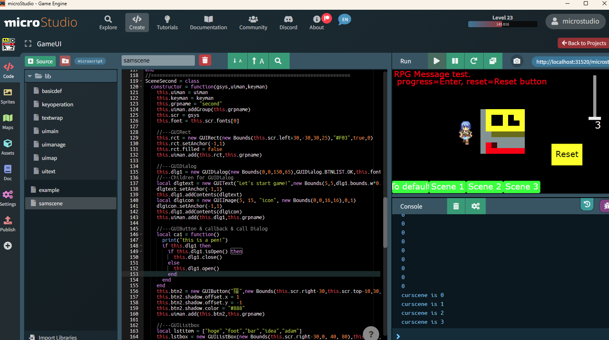

# microstudio-library-gameui

## このリポジトリについて

このリポジトリは、microStudioで使えるライブラリです。

ゲーム制作に便利なUIを簡単に作成できます。

## 主な機能

* ボタン
* テキスト（ラベル）
* スライダー
* チェックボックス
* ラジオボタン
* リストボックス
* 画像
* アニメーション画像
* コンテナ
* スクロール領域
* ダイアログ
* キー操作管理
* UI間のカーソル移動制御

## 使い方

1. npm install を実行して依存関係を解決します。

2. npm run build を実行してzip圧縮します。

これにより、 以下のファイル・フォルダが圧縮されます。

* assets
* assets_th
* doc
* ms
* sprites
* project.json

3. [microstudio.dev](https://microstudio.dev) または スタンドアロン版のmicroStudioを開きます。

4. Createタブを開きます。

5. `Import Project` ボタンを押して、zipファイルを選択します。

6. ライブラリのプロジェクトとしてMy Projectsの一覧に並びます。

## ライブラリの設定方法

ライブラリをゲームプロジェクトで使用する方法は、下記Noteの記事をご覧ください。

[Code（ソース編集・ゲーム実行）パネル - Note.com](https://note.com/lumidina/n/n553e4e3677fc?magazine_key=m0fe223feeb8f)

## ドキュメント

microStudioのプロジェクトには標準でDocというドキュメント閲覧のページがついています。

`doc/doc.md` がそのドキュメントのファイルです。

`doc.md` はプロジェクトに1つだけなので、日本語訳`doc.ja.md` は本リポジトリの直下に用意しました。

こちらはライブラリには含めず、本リポジトリから閲覧のみのご利用となります。

各クラスのリファレンスは `reference.md` または `reference.ja.md` に記載しています。

