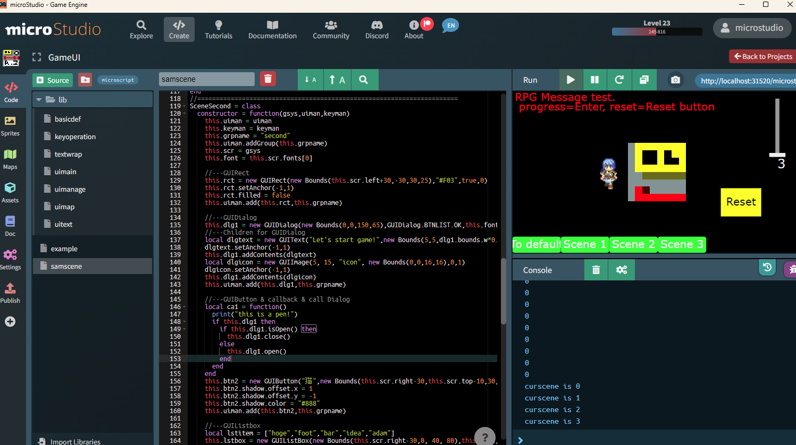

# microstudio-library-gameui

## About this repository

This repository is a library for use in microStudio.

You can easily create UI useful for game development.

## Main Features

* Buttons
* Text (Labels)
* Sliders
* Checkboxes
* Radio Buttons
* Listboxes
* Images
* Animated Images
* Containers
* Scroll Areas
* Dialogs
* Key Operation Management
* Cursor Movement Control Between UI Elements

## How to Use

1. Run `npm install` to resolve dependencies.

2. Run `npm run build` to create a zip archive.

This will compress the following files and folders:

* assets
* assets_th
* doc
* ms
* sprites
* project.json

3. Open [microstudio.dev](https://microstudio.dev) or the standalone version of microStudio.

4. Open the Create tab.

5. Press the `Import Project` button and select the zip file.

6. It will appear in your My Projects list as a library project.

## How to Configure the Library

To learn how to use the library in your game project, please see the following Note article:

[Code（ソース編集・ゲーム実行）パネル - Note.com](https://note.com/lumidina/n/n553e4e3677fc?magazine_key=m0fe223feeb8f)

## Documentation

microStudio projects come with a standard document viewing page called Doc.

`doc/doc.md` is the file for that document.

Since there is only one `doc.md` per project, the Japanese translation `doc.ja.md` has been placed in the root of this repository.

This is not included in the library and is for viewing from this repository only.

The reference for each class is described in `reference.md` or `reference.ja.md`.